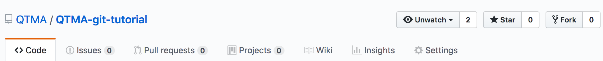

# Learn Git and GitHub With QTMA
This workshop is designed to take you through a Git workflow that is commonly used  
for collaborative software development; however, much of this knowledge is applicable
when developing individually. It's not meant to be an exhaustive reference, and
there are a lot of flags and variants on these commands that we don't cover. The aim
is to familiarize you with the logic behind Git and to teach you the most frequently
used commands, so that you have a working knowledge.

You'll be adding your name to the list of participants in `index.html`, which
you can see [here](http://git.qtma.ca). For those curious, the site is hosted on
[Netlify](https://www.netlify.com).

Note: code blocks where each line is preceded by `$`, like:
```
$ sudo apt-get update
$ sudo apt-get install git
```
are a stylistic convention used to display terminal commands. Do not enter the `$`
when copying these commands.

# Table of Contents
1. [Setup](#setup)
2. [Why Git](#why-git)
3. [Concept Overview](#concept-overview)
4. [Forking and Cloning](#forking-and-cloning)
5. [Branching](#branching)
6. [Making Changes](#making-changes)
7. [Undoing Changes](#undoing-changes)
8. [Getting Remote Changes](#getting-remote-changes)
9. [Conflicts](#conflicts)
10. [Pull Requests](#pull-requests)

## Setup
1. Create a [GitHub account](github.com)
2. Install Git
  - **Mac OS X** [Installer](https://sourceforge.net/projects/git-osx-installer/files/) or
    `brew install git` with Homebrew
  - **Windows** [Installer](https://git-for-windows.github.io/)
  - **Linux**
  ```
  $ sudo apt-get update
  $ sudo apt-get install git
  ```
3. Verify that the installation was successful with `git --version` in Terminal
or Command Prompt
4. Configure Git with the following commands in Terminal or Command Prompt.
This information will be attached to each commit you make.
```
$ git config --global user.name "Your Name"
$ git config --global user.username "yourusername"
$ git config --global user.email "youremail@email.com"
```

## Why Git
First, though, why version control? By using version control, you can progressively
save "snapshots" of your work and easily roll back to a "snapshot" if something
goes wrong. Additionally, these "snapshots" provide a history of development,
which will make the project more maintainable in the long run and can be highly
useful when adding new features or onboarding new team members. Lastly, version
control provides a way for multiple people, even tens of thousands at the scale
of companies like Google and Facebook, to contribute to the same codebase.

Git is one of the most commonly used version control systems, along with Mercurial
and SVN. It has become the industry standard for open source projects, which are usually
hosted on GitHub. Additionally, learning Git will allow you to share personal projects
on GitHub, which is a great way to show off your abilities to potential employers.

## Concept Overview
Git calls the "snapshots" discussed above "commits". You want to commit frequently
such that you have a complete and detailed history of development. However, each
commit should represent a unitary change - don't commit the way you save in Microsoft
Word. You should never commit half complete or broken code - add the class or complete
the function, then commit.

You don't have to add every changed file when you make a new commit. Git uses a
"staging area" which files are added to and then committed from. This allows for
much more flexibility when committing, and enables you to split your commits up
logically.

## Forking and Cloning
Now let's dive in! Press the "Fork" button in the top right corner of this repository.

This will produce a copy of the repository on your own GitHub account. This is a
common practice for open source projects, or other projects where you don't have
edit permission on the main repository. You'll be making changes in your own copy,
then submitting a "pull request" to propose changes to the main repository - more
on that later.

Next, we'll create a local copy of the repository on your machine. Navigate to your
own copy of the repo on GitHub, press the "Clone or download" button, and copy the
resulting URL. Next, open a Command Prompt or Terminal, navigate to the parent
directory where you want your repo to be stored, and type the following:
```
$ git clone https://github.com/your-username/QTMA-git-tutorial.git
$ cd QTMA-git-tutorial
```
In addition to creating a copy of the repository on your machine, the `clone`
command also links it to your repository on GitHub. This is called a "remote",
and it has been named "origin". This allows you to send and receive changes to
your copy of the repo on GitHub. But what about changes being made to the original
repository? We can add another remote, which we'll call "upstream", pointing
the main repository.
```
$ git remote add upstream https://github.com/QTMA/QTMA-git-tutorial.git
```
If you're working on a personal project or on a centralized team where everyone
has edit permission on the main repository, i.e. not open source, you can
forego the forking step and addition of a second remote and simply clone the
main repo directly to your machine.

## Branching
When multiple people are working on the same project, conflicts can arise if
people try to edit the same lines, someone deletes a file that someone else is using,
refactors a function in a breaking manner, etc. Branches allow you to keep a set
of commits separate from the main history, so that you don't need to worry about
other people's changes breaking yours, and vice versa while a feature is still under
development.

The `branch` command will create a new branch from whichever branch you are currently on.
Generally, we want to branch from master, which is the default branch, although there
are some workflows such as [GitFlow](https://nvie.com/posts/a-successful-git-branching-model/)
which use more complicated branching schemes. To view a list of branches, with the current
branch highlighted, use the following command:
```
$ git branch
```
After verifying that you're on master create a new branch to contain your feature
using `branch`, then switch to the new branch using `checkout`.
```
$ git branch <your-name>
$ git checkout <your-name>
```
Note that branches can be useful even when developing individually. If you are
developing multiple features concurrently, it can be helpful to separate the
development of each feature into its own branch in order to keep the main commit
history clean and organized.

## Making Changes
Now let's add your name to the participants list. In the text editor of your choice,
open `index.html`. Find this section:
```
<!-- Copy and paste this section and replace with your name -->
<div class="name-card">
  <div class="checkmark-container">
    <svg class="checkmark" xmlns="http://www.w3.org/2000/svg" viewBox="0 0 52 52">
      <circle class="checkmark__circle" cx="26" cy="26" r="25" fill="none"/>
      <path class="checkmark__check" fill="none" d="M14.1 27.2l7.1 7.2 16.7-16.8"/>
    </svg>
  </div>
  <p class="name">Your Name Here</p>
</div>
```
Copy and paste it below and replace the `Your Name Here` with your name. Now that
you've made your changes locally, you'll want to commit it.

As you're working on more complicated sets of changes that affect multiple files, you may
want to check to see what you've touched and how Git perceives your changes.
```
$ git status
```
This command will show you which changes are staged for commit (already added to
the current commit), and which have been modified but have not been staged.
```
$ git add .
```
This command stages all new files, modified files, and deleted files for commit.
```
$ git add <file name or directory name>
```
But `git add` can also be used much more granularly, by specifying individual files
or directories.

Say you didn't follow our advice and weren't committing along the way and now have
a file with several modifications that you believe should logically be split up into
different commits. Don't fret!
```
$ git add -p
```
`git add` has an interactive mode which allows you to select chunks within files
to commit, rather than having to commit the entire file/set of changes in a file.
It presents one chunk at a time and prompts for a command: `y` to stage the chunk,
`n` to ignore the chunk, `s` to split it into smaller chunks, `e` to manually edit
the chunk, and `q` to exit. Alternately, just press `?` every time to print the
commands.

So now that you've staged your changes, you're ready to commit.
```
$ git commit -m "<commit message here>"
```
The `-m` flag means "message". If you have a lot to say you might want to omit
the flag. Using `git commit` without flags will pull up your terminal's default
text editor, usually Vim or Nano, and allow you to write your commit message.
Commit messages should be relatively concise and highly descriptive, so that reading
the commit history chronologically provides a coherent document of development.
While it's not necessary, adhering to some stylistic conventions will make reviewing
commit logs much nicer. A good rule of thumb is to write imperatively in the present
tense, with the first letter capitalized and without a period. This mimics Git's
own style when it automatically generates commit messages. For example, when
merging a branch, git generates the message:
```
Merge branch 'my-feature'
```

In instances where you want to commit all changes and add a message inline, you
can omit the separate `git add` command and simply use:
```
$ git commit -am "<commit message here"
```

Now that you've committed your changes, you can push them to your repository on
GitHub. Generally, you wouldn't do this after every commit in case you wanted to
clean up/squash/amend commits but that's not important for our purposes right now.
```
$ git push origin <your-name>
```
The `git push` command takes two arguments: the name of the remote you're pushing
to (remember that `origin` is your repo and `upstream` is the main repo), and
the name of the branch you want to push.

## Undoing Changes
There are a couple of possible scenarios where you may need to undo some questionable
commits. The most straightforward is if the shady commit is the most recent one,
and it is still local (i.e. it hasn't been pushed to a remote).
```
$ git commit --amend
```
This will collapse all of your staged changes into the most recent commit, and
allow you to write a new commit message. This is also useful is you notice that
there's a typo in your commit message that you'd like to change - invoking the
command without any staged changes will simply allow you to rewrite your most
recent commit message.

If you have a messed up several local commits and need to find the most recent
clean one, you'll have to go digging.
```
$ git log --oneline
```
This command will display will display a compact commit history. Copy the hash
(something like `bd60c14`) of the commit you'd like to step back to.
```
$ git reset --hard <commit hash>
```
Invoking the above command will effectively erase all commits after the specified commit,
as if they had never happened. You should only use this locally. Obviously, a commit
disappearing when others depend on it could be problematic, and Git will block you
and complain about the local branch being out of date when you try to push it to
a remote, because of the missing local commits.

If you're working on a public repository, the commit has already made it to the remote,
etc., `git revert` is the preferred option. Unlike `git reset`, where all subsequent
commits are deleted, `git revert` undoes a single, specified commit.
```
$ git revert <commit hash>
```
Using this command produces a new commit which is the inverse of the changes made
in the offending commit. Because of this, `git revert` is nondestructive and can
be used safely on public repos.

## Getting Remote Changes
## Conflicts
## Pull Requests
